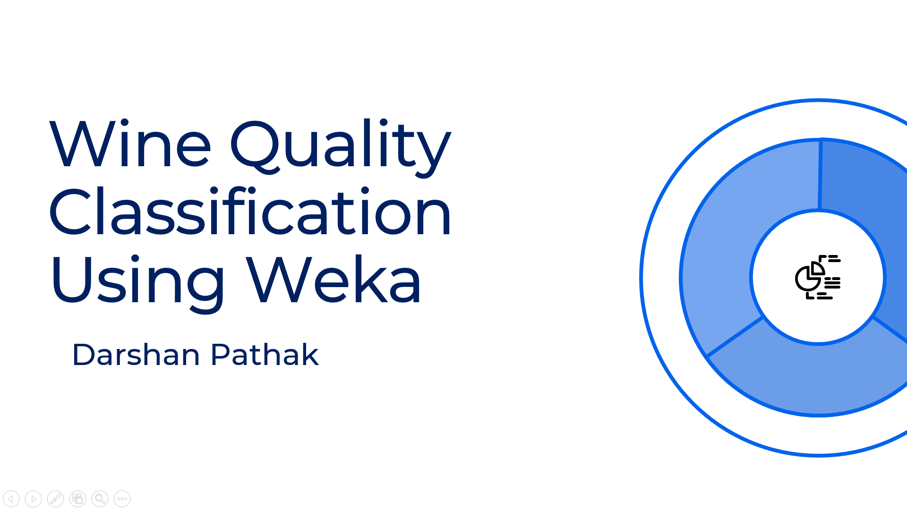
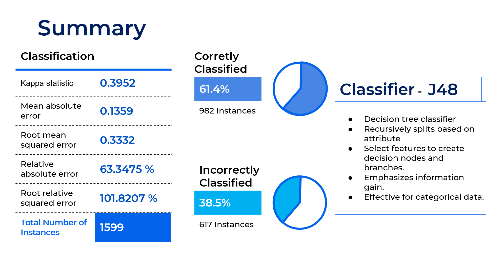

# Case Studies Repository

Welcome to the Case Studies Repository. This repository contains a collection of case studies that cover various topics and industries. Each case study includes detailed analysis, findings, and actionable insights.

### Table of Contents

1. [Visual Studio_Code: A Practical Case Study](#Visual_Studio_Code_A_Practical_Case_Study)
2. [Wine Quality Classification Using Weka](#Wine_Quality_Classification_Using_Weka)

### Case Studies

## Visual_Studio_Code_A_Practical_Case_Study

#### Presented By: Darshan Pathak

Visual Studio Code (VS Code) is a widely used, powerful code editor in the software development industry. This case study explores its key features, advantages, disadvantages, and practical applications.

VS Code stands out for its versatility, extensive range of extensions, and ease of use. It supports numerous programming languages, offers robust debugging capabilities, and integrates seamlessly with Git version control. Its lightweight nature, cross-platform compatibility, and open-source availability make it a top choice for developers.

Despite its strengths, VS Code has some limitations, such as performance issues with large projects and a learning curve for beginners.

The case study includes a practical demonstration of building a simple web application using HTML, CSS, and JavaScript within VS Code, showcasing its practical utility and efficiency in real-world scenarios.

  
  

[Project Link](https://github.com/Pathakdarshan12/Case_Study/tree/main/VS_Code_Case_Study)

## Wine_Quality_Classification_Using_Weka

#### Presented By: Darshan Pathak

This case study examines wine quality classification using the Weka software and the J48 decision tree algorithm. Weka, a comprehensive suite of machine learning tools, is used to preprocess the Wine Quality dataset, build the classifier, and evaluate its performance.

The J48 classifier, known for its effectiveness with categorical data, was applied to the dataset, resulting in 61.4% correctly classified instances. Key metrics such as Kappa statistic, mean absolute error, and detailed accuracy metrics provided insights into the model's performance.

Overall, this case study highlights the practical application of classification algorithms in machine learning and their role in data mining.

[Project_Link](https://github.com/Pathakdarshan12/Case_Study/tree/main/Wine_Quality_Classification_Using_Weka)

  
  

## Contact

